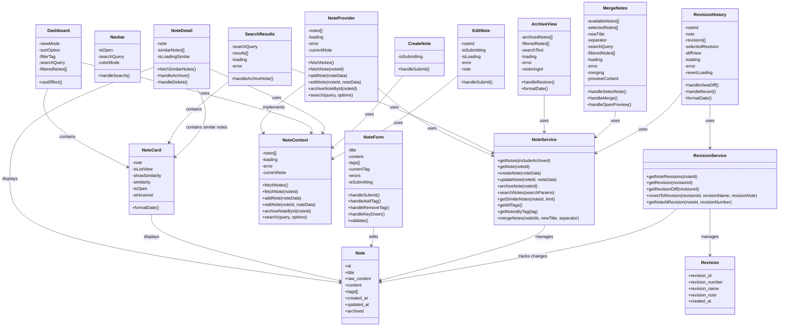

```mermaid
classDiagram
    %% Main Services
    class NoteService {
        +getNotes(includeArchived)
        +getNote(noteId)
        +createNote(noteData)
        +updateNote(noteId, noteData)
        +archiveNote(noteId)
        +searchNotes(searchParams)
        +getSimilarNotes(noteId, limit)
        +getAllTags()
        +getNotesByTag(tag)
        +mergeNotes(noteIds, newTitle, separator)
    }

    class RevisionService {
        +getNoteRevisions(noteId)
        +getRevision(revisionId)
        +getRevisionDiff(revisionId)
        +revertToRevision(revisionId, revisionName, revisionNote)
        +getNoteAtRevision(noteId, revisionNumber)
    }

    %% Context Provider
    class NoteContext {
        -notes[]
        -loading
        -error
        -currentNote
        +fetchNotes()
        +fetchNote(noteId)
        +addNote(noteData)
        +editNote(noteId, noteData)
        +archiveNoteById(noteId)
        +search(query, options)
    }

    class NoteProvider {
        -notes[]
        -loading
        -error
        -currentNote
        +fetchNotes()
        +fetchNote(noteId)
        +addNote(noteData)
        +editNote(noteId, noteData)
        +archiveNoteById(noteId)
        +search(query, options)
    }

    %% Components
    class NoteForm {
        -title
        -content
        -tags[]
        -currentTag
        -errors
        -isSubmitting
        +handleSubmit()
        +handleAddTag()
        +handleRemoveTag()
        +handleKeyDown()
        +validate()
    }

    class NoteCard {
        -note
        -isListView
        -showSimilarity
        -similarity
        -isOpen
        -isHovered
        +formatDate()
    }

    class Navbar {
        -isOpen
        -searchQuery
        -colorMode
        +handleSearch()
    }

    %% Pages
    class Dashboard {
        -viewMode
        -sortOption
        -filterTag
        -searchQuery
        -filteredNotes[]
        +useEffect()
    }

    class NoteDetail {
        -note
        -similarNotes[]
        -isLoadingSimilar
        +fetchSimilarNotes()
        +handleArchive()
        +handleDelete()
    }

    class CreateNote {
        -isSubmitting
        +handleSubmit()
    }

    class EditNote {
        -noteId
        -isSubmitting
        -isLoading
        -error
        -note
        +handleSubmit()
    }

    class SearchResults {
        -searchQuery
        -results[]
        -loading
        -error
        +handleArchiveNote()
    }

    class ArchiveView {
        -archivedNotes[]
        -filteredNotes[]
        -searchText
        -loading
        -error
        -restoringId
        +handleRestore()
        +formatDate()
    }

    class MergeNotes {
        -availableNotes[]
        -selectedNotes[]
        -newTitle
        -separator
        -searchQuery
        -filteredNotes[]
        -loading
        -error
        -merging
        -previewContent
        +handleSelectNote()
        +handleMerge()
        +handleOpenPreview()
    }

    class RevisionHistory {
        -noteId
        -note
        -revisions[]
        -selectedRevision
        -diffView
        -loading
        -error
        -revertLoading
        +handleViewDiff()
        +handleRevert()
        +formatDate()
    }

    %% Models (Inferred from usage)
    class Note {
        +id
        +title
        +raw_content
        +content
        +tags[]
        +created_at
        +updated_at
        +archived
    }

    class Revision {
        +revision_id
        +revision_number
        +revision_name
        +revision_note
        +created_at
    }

    %% Relationships
    NoteProvider --> NoteContext : implements
    NoteProvider --> NoteService : uses
    Dashboard --> NoteContext : uses
    NoteDetail --> NoteContext : uses
    NoteDetail --> Note : displays
    CreateNote --> NoteContext : uses
    EditNote --> NoteContext : uses
    SearchResults --> NoteService : uses
    ArchiveView --> NoteService : uses
    MergeNotes --> NoteService : uses
    RevisionHistory --> RevisionService : uses
    RevisionHistory --> NoteService : uses
    NoteCard --> Note : displays
    NoteForm --> Note : edits
    Dashboard --> NoteCard : contains
    SearchResults --> NoteCard : contains
    NoteDetail --> NoteCard : contains similar notes
    NoteService --> Note : manages
    RevisionService --> Revision : manages
    RevisionService --> Note : tracks changes
```